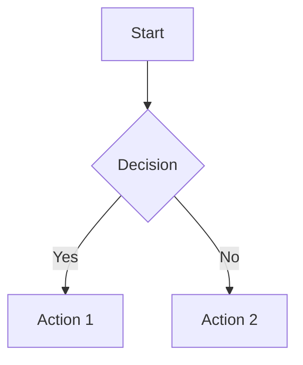
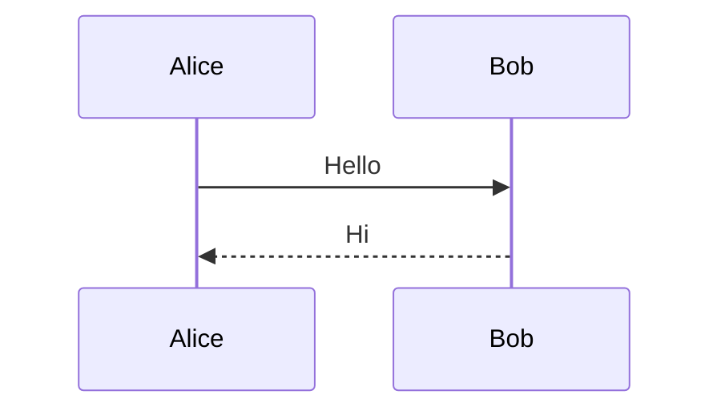

# Obsidian Syntax Reference

## Wiki Links

**Basic link:**
```markdown
[[Note Title]]
```

**Link with alias:**
```markdown
[[Note Title|Display Text]]
```

**Link to heading:**
```markdown
[[Note Title#Heading]]
```

**Link to paragraph (block ID):**
```markdown
[[Note Title#^block-id]]
```

**Link with alias to heading:**
```markdown
[[Note Title#Heading|Display Text]]
```

## Embeds

**Embed file:**
```markdown
![[Image.png]]
![[PDF.pdf]]
![[Note Title]]
```

**Embed specific part:**
```markdown
![[Note Title#Heading]]
![[Note Title#^block-id]]
```

**Embed with resize:**
```markdown
![[Image.png|300]]
```

## Tags

**Inline tags:**
```markdown
#tag
#multi-word-tag
#nested/tag
```

**Tag in frontmatter:**
```yaml
---
tags: [tag1, tag2, tag3]
---
```

**Nested tags:**
```markdown
#project/active
#project/completed
```

## Frontmatter (YAML)

**Basic properties:**
```yaml
---
type: note
created: 2026-01-21
modified: 2026-01-21
tags: [important, reference]
status: active
---
```

**Complex properties:**
```yaml
---
project:
  name: "My Project"
  status: in-progress
  deadline: 2026-02-01
team:
  - name: "Alice"
    role: "Developer"
  - name: "Bob"
    role: "Designer"
---
```

## Callouts

**Basic callout:**
```markdown
> [!INFO] Callout Title
> Callout content
```

**Supported types:**
- `INFO` - Blue
- `SUCCESS` - Green
- `WARNING` - Yellow
- `ERROR` - Red
- `TIP` - Cyan/Purple gradient

**Foldable callout:**
```markdown
> [!INFO]- Click to expand
> Hidden content
```

**Callout with nested content:**
```markdown
> [!TIP] Pro Tip
> - List item 1
> - List item 2
>
> ```js
> console.log("code block");
> ```
```

## Block References

**Create block ID:**
```markdown
This is a paragraph^my-block-id
```

**Reference block:**
```markdown
![[Note Title#^my-block-id]]
```

**Embed block in current note:**
```markdown
> This is a paragraph^my-block-id

Reference it like this^ref

See ^ref for details.
```

## Dataview Queries

**Basic list:**
```dataview
LIST
FROM #tag
```

**Table view:**
```dataview
TABLE file.name, status, deadline
FROM #project
WHERE status = "active"
SORT deadline ASC
```

**Task list:**
```dataview
TASK
FROM #project
WHERE !completed
GROUP BY file.name
```

**Complex query:**
```dataview
TABLE
  rows.file.link AS "Related Notes",
  length(rows) AS "Count"
FROM [[Current Note]]
FLATTEN file.links AS outgoing
GROUP BY outgoing
WHERE outgoing != [[Current Note]]
```

## Formatting

**Highlighting:**
```markdown
==highlighted text==
```

**Internal highlights:**
```markdown
This is ==important== and ==also this==
```

**Subscript/Superscript:**
```markdown
H~2~O
E = mc^2^
```

**Footnotes:**
```markdown
This is a reference[^1]

[^1]: Footnote content
```

## Code Blocks

**Basic:**
````markdown
```javascript
function hello() {
  console.log("Hello");
}
```
````

**With syntax highlighting and line numbers:**
````markdown
```javascript {1,3-5} showLineNumbers
function hello() {
  console.log("Hello");
  return true;
}
```
````

**Inline code:**
```markdown
Use `backticks` for inline code
```

## Mathematical Expressions

**Inline math:**
```markdown
$E = mc^2$
```

**Block math:**
```markdown
$$
\frac{n!}{k!(n-k)!} = \binom{n}{k}
$$
```

## Diagrams (Mermaid)

**Flowchart:**
````markdown

````

**Sequence diagram:**
````markdown

````

## Comments

**HTML comments (not displayed):**
```markdown
<!-- This is a comment -->
```

**Percent syntax:**
```markdown
%% This is also a comment %%
```

## Admonitions with Icons

**Custom icons in callouts:**
```markdown
> [!INFO] 💡 Pro Tip
> Content here
```

**Emoji as icons:**
```markdown
## 📚 Reference
## 💡 Idea
## ⚠️ Warning
```
